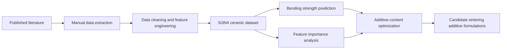

# 🧪 QQ Sintering Aid ML

<p align="center">
  
  
  
  
</p>

## 📌 Overview

This repository contains a literature-derived dataset for **silicon nitride (Si₃N₄) ceramics** and is designed to support machine-learning-based prediction of mechanical performance and data-driven optimization of sintering additive contents.

The current dataset focuses on the relationship among:

* **Ceramic composition**
* **Sintering additive type and content**
* **Processing / sintering parameters**
* **Density and microstructural descriptors**
* **Mechanical properties**, especially **bending strength**

The long-term objective is to build a reproducible workflow for identifying promising sintering additive formulations and predicting the bending strength of Si₃N₄ ceramics from composition–processing–property data.

---

## 🎯 Project Objectives

This project aims to:

1. Construct a structured **composition–processing–property database** for Si₃N₄ ceramics from published literature.
2. Use machine learning to predict **bending strength (MPa)** based on sintering additives and processing parameters.
3. Analyze the influence of key sintering additives, such as **Y₂O₃, Al₂O₃, MgO, AlN**, and other dopants.
4. Explore data-driven strategies for recommending optimal or promising sintering additive content ranges.
5. Provide a reusable dataset for future ceramic informatics and materials-design studies.

---

## 📁 Repository Contents

```text
qq-sintering-aid-ml/
│
├── README.md
└── final_Si3N4_513rows.xlsx
```

### Dataset file

| File                       | Description                                                                                                                                                      |
| -------------------------- | ---------------------------------------------------------------------------------------------------------------------------------------------------------------- |
| `final_Si3N4_513rows.xlsx` | Curated Si₃N₄ ceramic dataset containing 513 literature-derived records with composition, sintering parameters, additive information, and mechanical properties. |

---

## 📊 Dataset Description

The dataset includes literature-extracted and curated records related to Si₃N₄ ceramics. The main data categories include:

| Category                  | Example variables                                                 |
| ------------------------- | ----------------------------------------------------------------- |
| Base material information | Si₃N₄ content, powder characteristics, α/β phase information      |
| Sintering additives       | Y₂O₃, Al₂O₃, MgO, AlN, and other additive contents                |
| Processing parameters     | Sintering method, temperature, holding time, pressure, atmosphere |
| Densification descriptors | Density, relative density, density source / review flags          |
| Mechanical properties     | Bending strength, Vickers hardness, fracture toughness            |
| Data provenance           | Source dataset, source row, literature notes, unmapped fields     |

The primary target variable for machine learning is:

```text
Bending strength (MPa)
```

Potential secondary targets include:

```text
Vickers hardness
Fracture toughness
Relative density
```

---

## 🤖 Intended Machine Learning Tasks

### 1. Forward prediction

Predict bending strength from composition and sintering parameters:

```text
composition + processing parameters → bending strength
```

Potential models:

* Random Forest
* XGBoost
* LightGBM
* CatBoost
* Support Vector Regression
* Neural networks

### 2. Feature importance analysis

Identify which variables contribute most strongly to bending strength, such as:

* Y₂O₃ content
* Al₂O₃ content
* MgO content
* Sintering temperature
* Holding time
* Relative density
* Sintering technique

### 3. Additive-content optimization

Search for promising sintering additive combinations under practical constraints:

```text
maximize bending strength
subject to additive-content and processing constraints
```

Example optimization objective:

```text
Maximize: predicted bending strength (MPa)
Variables: Y₂O₃, Al₂O₃, MgO, AlN, sintering temperature, holding time
Constraints: realistic additive ranges and feasible processing windows
```

---

## 🧭 Suggested Workflow



---

## ⚠️ Notes on Data Use

The dataset was curated from published literature. Users should carefully check the original sources and field definitions before using the data for formal modeling or publication.

Important considerations:

* Some records may contain missing values.
* Some fields may require additional normalization before machine learning.
* Different papers may report properties under different testing standards.
* Bending strength may depend on specimen geometry, surface treatment, and testing method.
* Literature-derived datasets may contain hidden heterogeneity and should be interpreted cautiously.

---

## 🚀 Future Updates

Planned improvements may include:

* Data dictionary and variable-unit documentation
* Jupyter notebooks for data overview and visualization
* Machine learning scripts for bending strength prediction
* Cross-validation and model-performance comparison
* SHAP-based feature importance analysis
* Additive-content optimization scripts
* Recommended candidate formulations for high-strength Si₃N₄ ceramics

---

## 👤 Maintainer

**QQ**
Machine learning for Si₃N₄ ceramic sintering additive design and bending strength prediction.
